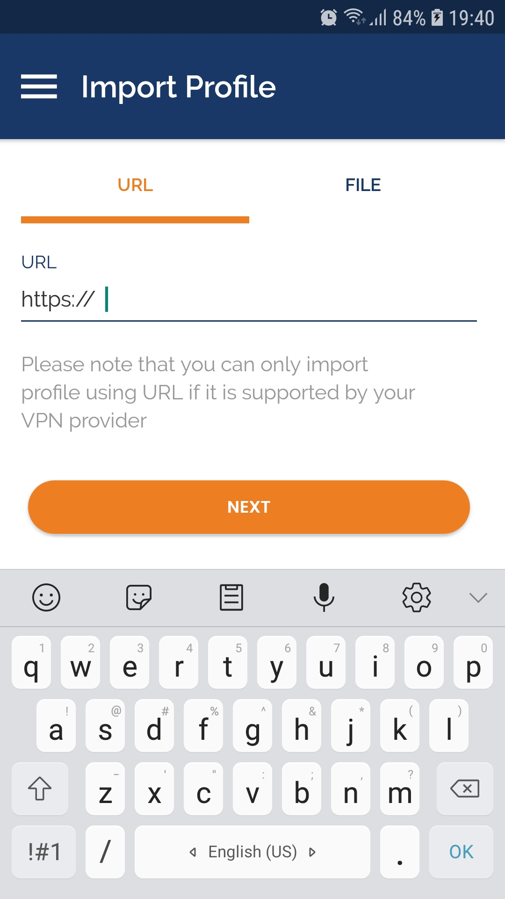
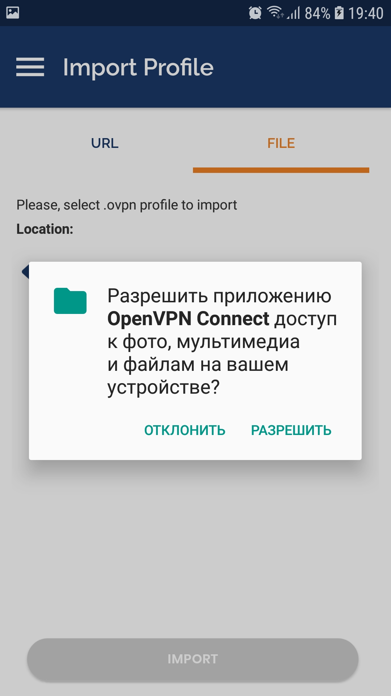
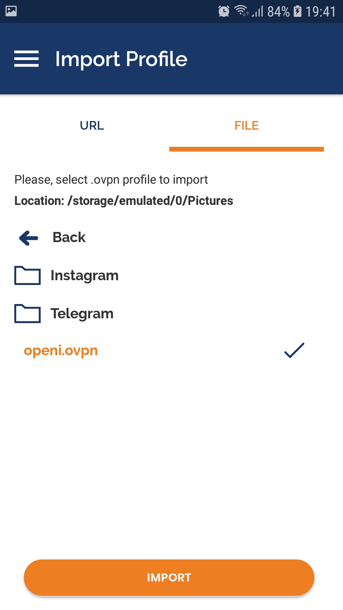
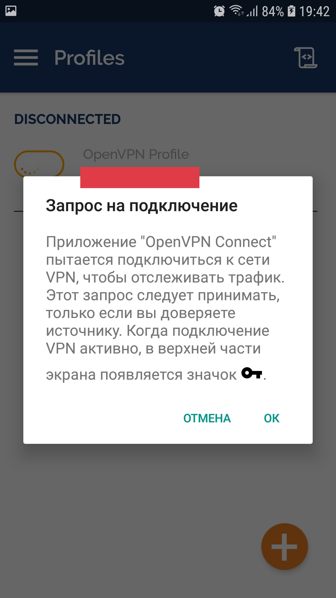
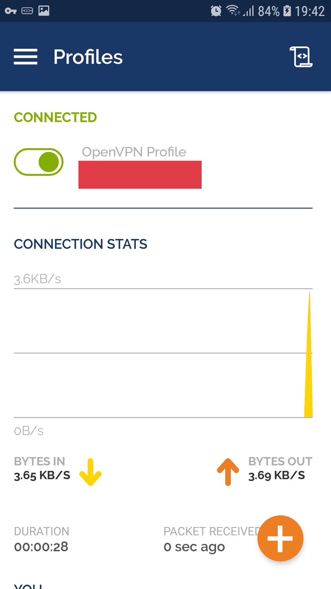
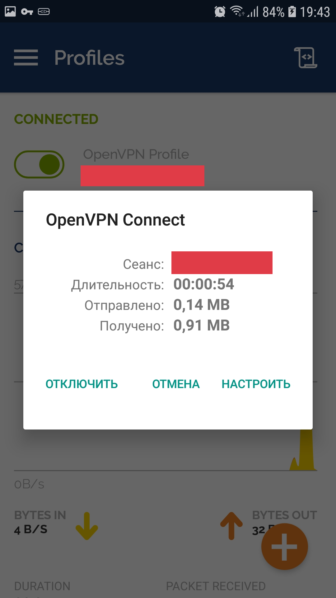

# Android

1. Установите приложение OpenVPN Connect [Скачать](https://play.google.com/store/apps/details?id=net.openvpn.openvpn)

2. Скачайте и загрузите файл конфигурации подключения OpenVPN (файл .ovpn).

3. Откройте приложение и нажмите на таб ```FILE```



4. Дайте разрешение



5. Выбирите файл .ovpn



6. Нажмите галку ```Connect after import``` и потом кнопку ```ADD```


7. Нажмите ```OK```



8. VPN подключен



9. VPN можно отключить


