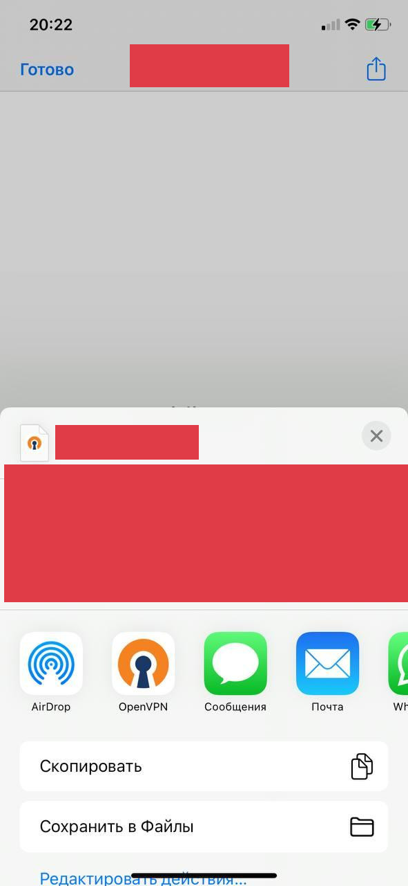
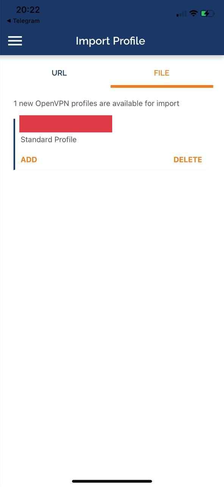
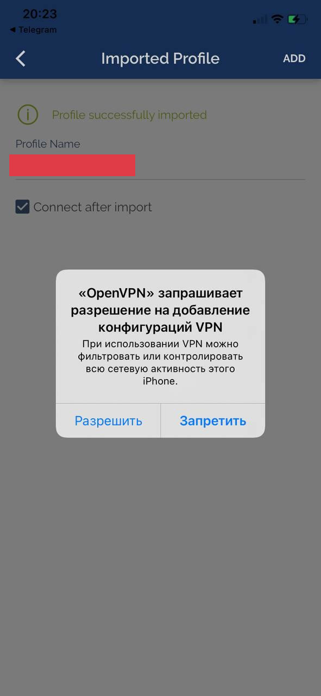
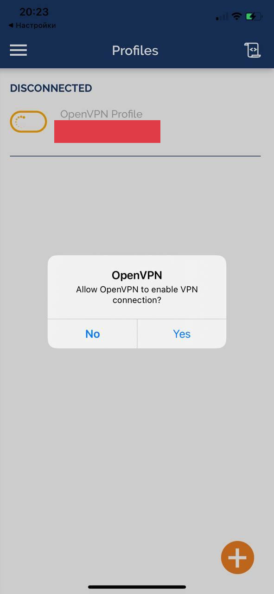
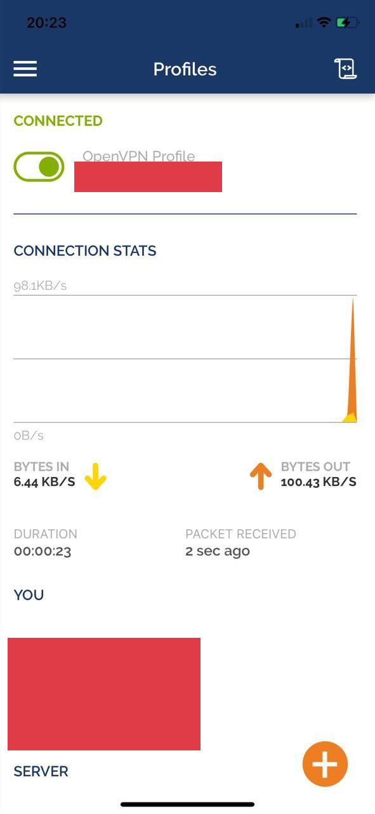

# IOS

1. Установите приложение OpenVPN Connect [Скачать](https://apps.apple.com/us/app/openvpn-connect/id590379981)

2. Скачайте и загрузите файл конфигурации подключения OpenVPN (файл .ovpn).

3. Откройте скаченный файл и нажмите на share(иконка в правом верхнем углу) и выберите OpenVPN



4. Нажмите ```ADD```



5. Нажмите галку ```Connect after import``` и потом кнопку ```ADD```


6. Дайте права



7. Нажмите ```Yes```



8. VPN подключен



