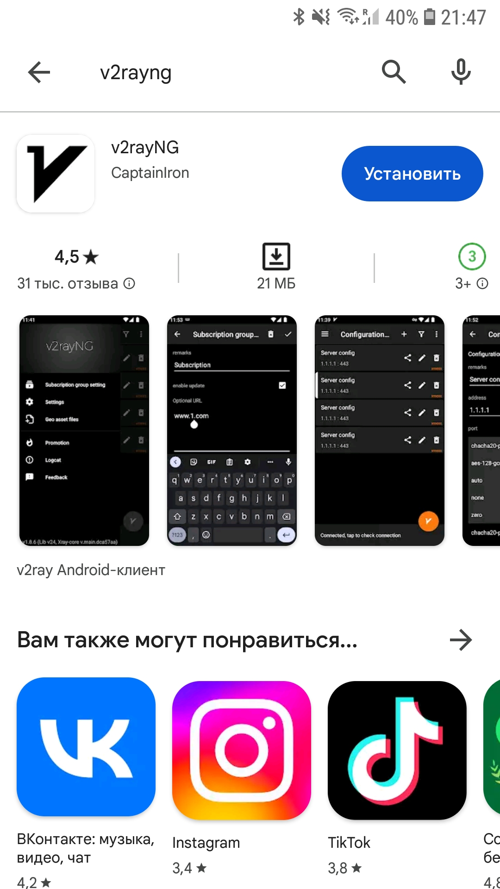
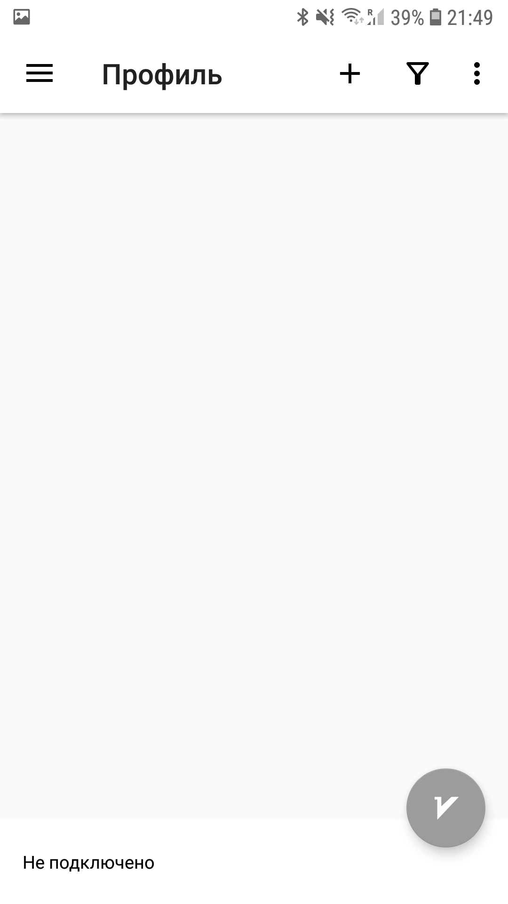
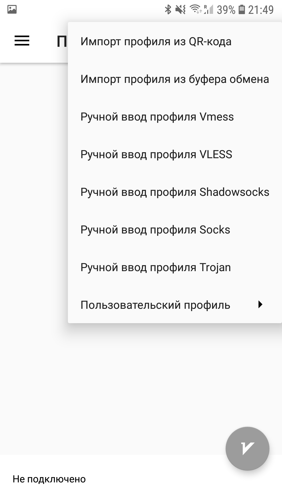
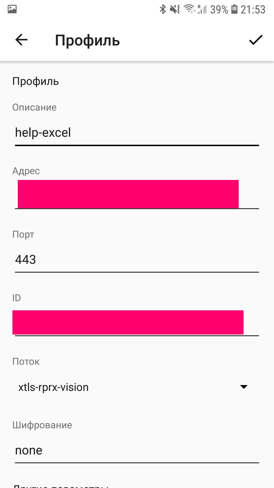
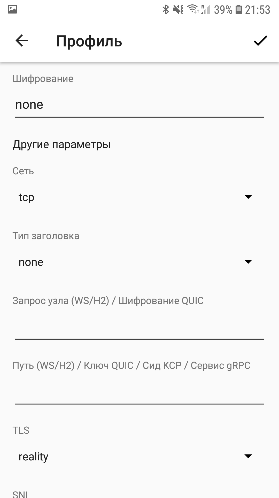
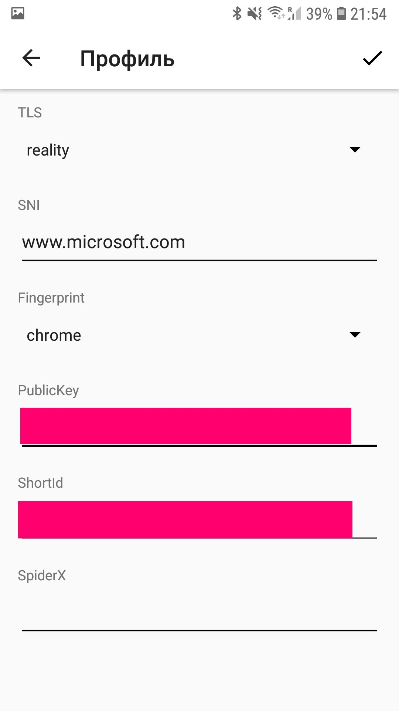

# Android

1. Скачиваем v2rayNG из оффициального магазина google play.

2. Запускаем приложение и нажимаем на +

3. Выбираем Ручной ввод профиля VLESS

4. Настроим 
Тут нужно вставить данные полученные от нас
а именно UUID, Address, Reality Pbk и Reality Sid

