# IOS

1. Скачиваем FoXray из оффициального магазина apple appStore.

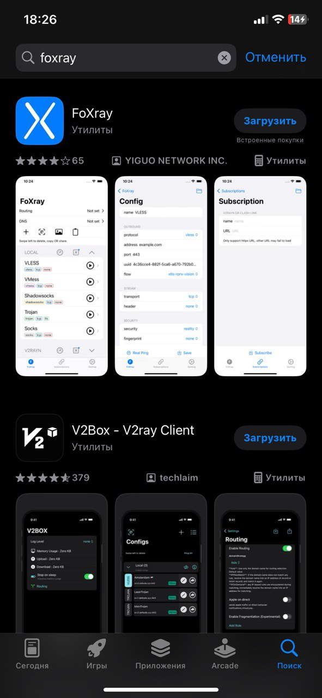

2. Соглашаемся с privacy policy

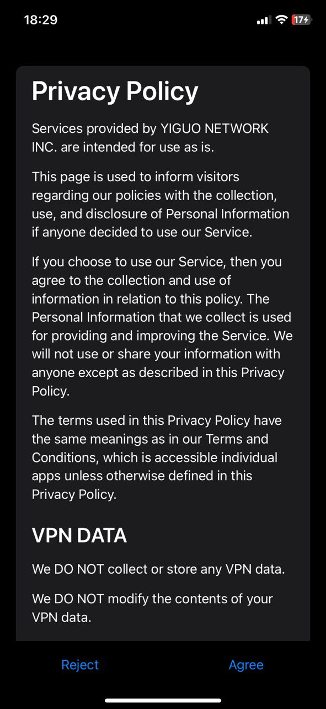

3. Открываем приложение FoXray

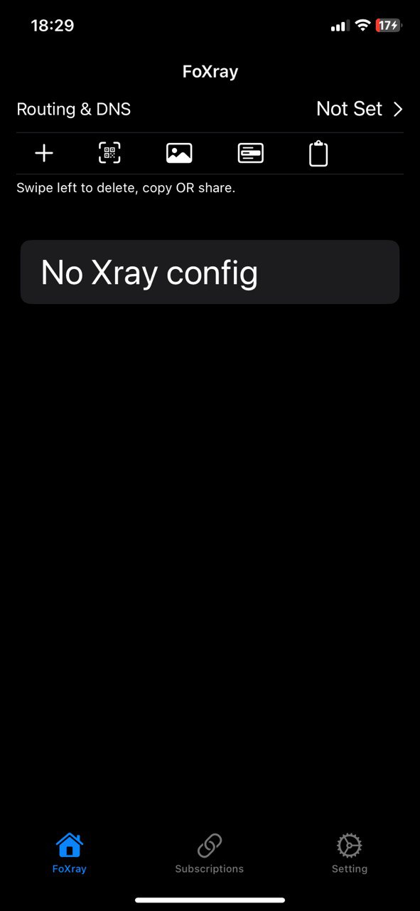

4. Нажимаем + и создаем подключение.
Тут нужно вставить данные полученные от нас
а именно UUID, Address, Reality Pbk и Reality Sid

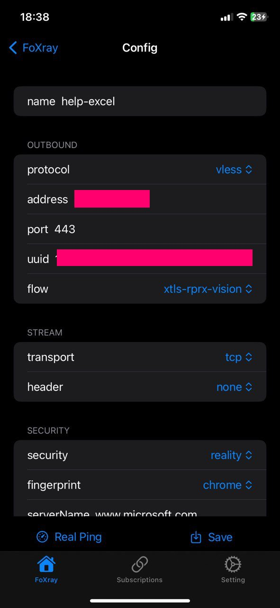
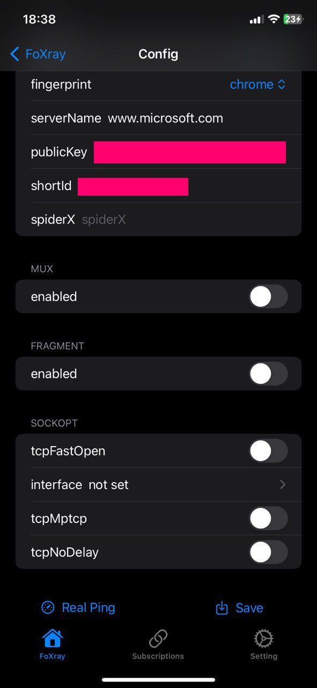

Сохраняем настройки, нажав ```save```

5. Нажимаем Routung & DNS 

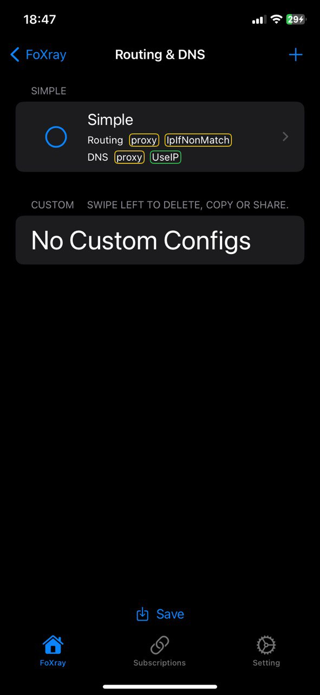

6. Нажимаем на Simple и видим это окно

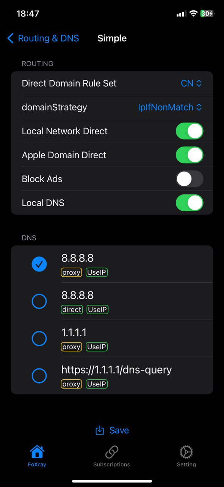

7. Нажимаем Block Ads и выбираем в Direct Domain Rule Set как RU

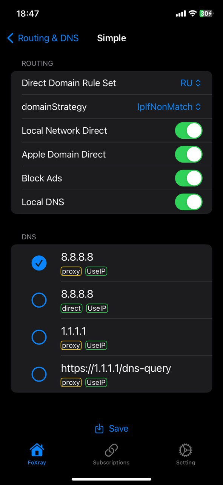

Сохраняем настройки, нажав ```save```

8. Возвращаемся на главный экран и нажимаем на play

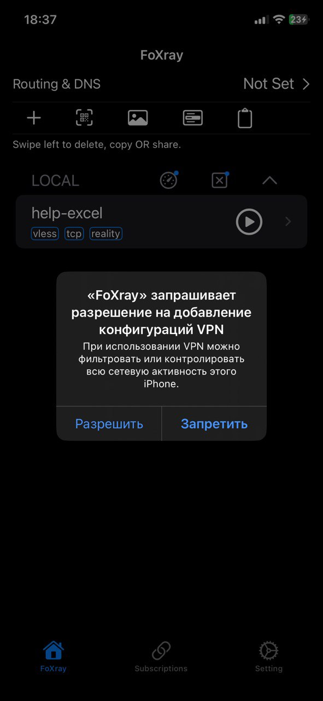

# ДЕБАГ (На случай проблем с подключением)

Если у вас отключается клиент, просьба снять логи и отправить их в техническую поддержку

9. Нажимаем на Settings в Tabbar и нажимаем ```Log```

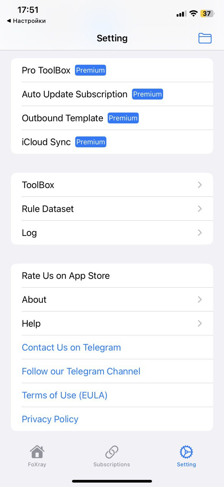

10. Меняем logLevel на ```debug | error``` и нажимаем ```Save```

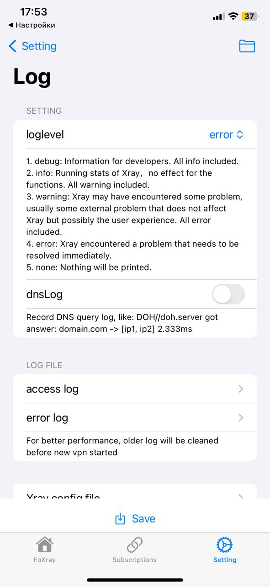

11. После того как воспроизвели проблему, переходите в error log и копируйте информацию.  
После этого дебаг можно отключить

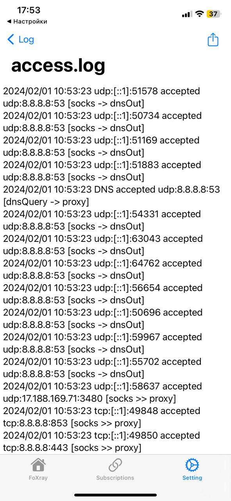

> ### Примечание:
> Иногда помогает отключение ```Limit Memory Usage```  
> Попробуйте его отключить и если проблема повторятся, то тогда прошу прислать логи в поддержку

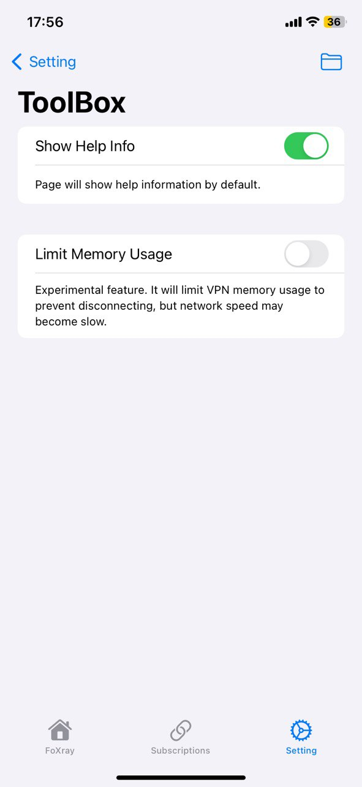