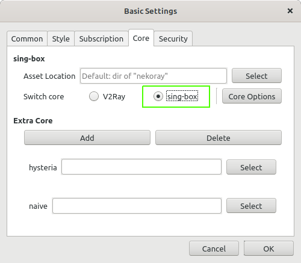
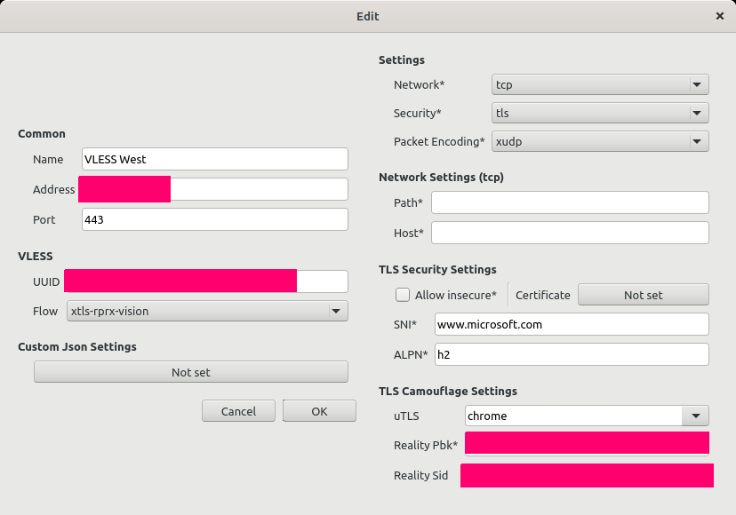
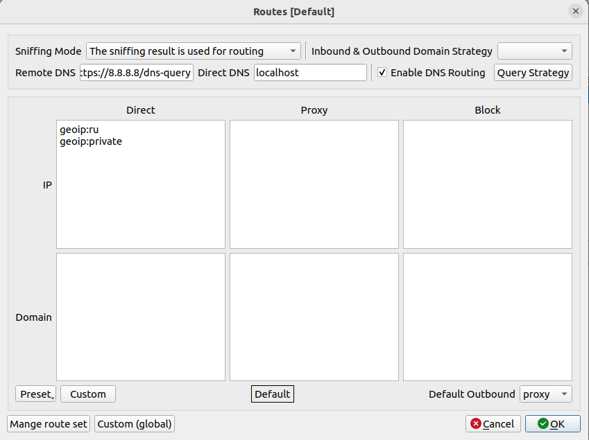

# Macos

## Установка

1. Скачиванием nekoray_amd64.zip или nekoray_arm64.zip [отсюда](https://github.com/abbasnaqdi/nekoray-macos/releases/tag/2.25)

Есть более современные версии. Но GUI немного отличается. Пока не тестил.

## Настройка

1. Выбираем в настройках core Sing-box с помощью меню Preferences -> Basic Settings -> Core

2. Затем создаем подключение к серверу с помощью меню Server -> New Profile

тут нужно вставить данные полученные от нас
а именно UUID, Address, Reality Pbk и Reality Sid

3. Чтобы трафик с ru сегменту ходил напрямую нужно поменять с помощью меню Preferences -> Routing Settings

Теперь достаточно нажать сверху галочку System proxy и затем правой кнопкой мыши на строке и нажать START вы попадаете в интернет через ваш новый прокси.